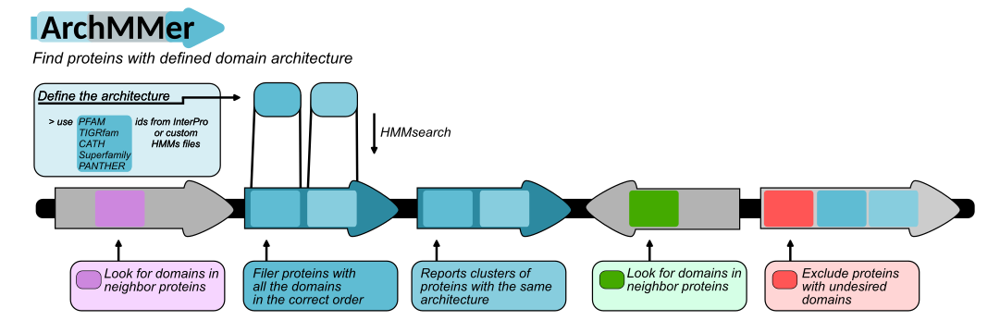

# ArchMMer
ArchMMer is a python program that uses HMMER hmmsearch tool to look for proteins with a defined domain architecture.
The domain architecture can be defined either by specifying InterPro IDs (PFAM, CATH, TIGR, PANTHER and Superfamily are suported), or using custom HMMs created with th HMMER suit.



## Requirements
* HMMER v3 or newer
* Biopython
* Pandas
* Python libraries: argparse, requests, gzip, os, sys, re, glob, subprocess
  (Tested on linux)

## Usage
```
usage: Archmmer.py [-h] [-i INPUTFOLDER] [--Overwrite] [-x GBEXTENSION]
                   [-G QUERYGENUS] [-n NUMSEQS] [-f DOWNLOADFOLDER]
                   [-a ACCESSIONS [ACCESSIONS ...]] [-r REFGENOME] [-R REFACC]
                   [-c NCPU] [-e EVALUE] [-C HMM_COVERAGE]
                   [-p PFAMID [PFAMID ...]] [-P HMMS [HMMS ...]] [-s MIN_SIZE]
                   [-S MAX_SIZE]
                   [--Exclude_hmm EXCLUDE_PFAMIDS [EXCLUDE_PFAMIDS ...]]
                   [--Exclude_hmm_table EXCLUDE_PFAMIDS_TABLE]
                   [--Exclude_hmm_files EXCLUDE_HMMS [EXCLUDE_HMMS ...]]
                   [--Architecture_file ARCHITECTURE_FILE]
                   [--Architecture_hmmid ARCHITECTURE_PFAMID]
                   [--include_in_synteny_hmm INCLUDE_IN_SYNTENY [INCLUDE_IN_SYNTENY ...]]
                   [--include_in_synteny_hmm_files INCLUDE_HMMS [INCLUDE_HMMS ...]]
                   [--force_synteny] [-u UP] [-d DOWN] [-t TOLERANCE] [-m]

This program was designed to identify and classify proteins with a defined
architecture in bacteria.

options:
  -h, --help            show this help message and exit

Input files:
  -i INPUTFOLDER, --InputFolder INPUTFOLDER
                        Folder containing the genomes to analyze in Genbank
                        format. The extension of the genbank files should be
                        passed by -x argument.
  --Overwrite           Overwrite the results folder.
  -x GBEXTENSION, --GbFileExtension GBEXTENSION
                        Genbank file extension: gb, gbff, gbk.

Download genomes from NCBI:
  -G QUERYGENUS, --Genus QUERYGENUS
                        Query genome genus for NCBI search.
  -n NUMSEQS, --numberOfSequences NUMSEQS
                        Number of sequences to download.
  -f DOWNLOADFOLDER, --DownloadFolder DOWNLOADFOLDER
                        Folder that will be used to download NCBI genomes and
                        as working folder.
  -a ACCESSIONS [ACCESSIONS ...], --accession ACCESSIONS [ACCESSIONS ...]
                        List of NCBI assembly accession numbers.

Reference genome:
  -r REFGENOME, --RefGenome REFGENOME
                        Genome to use as reference for plot. The Gb file name
                        must be passed as argument (e.g., 'genome.gb')
  -R REFACC, --RefAccession REFACC
                        Genome to use as reference for plot. Genbank assembly
                        accession number

HMMER options:
  -c NCPU, --ncpu NCPU  Number of CPUs to use in HMMER.
  -e EVALUE, --evalue EVALUE
                        E-value for hmmsearch.
  -C HMM_COVERAGE, --hmm_coverage HMM_COVERAGE
                        HMM coverage for hmmsearch.

Domain architecture definition:
  -p PFAMID [PFAMID ...], --hmm_ids PFAMID [PFAMID ...]
                        Architecture of the protein domains. A list of the
                        PFAM/Superfamily/Panther/TIGRfam/CATH IDs from
                        InterPro in the correct order and number, representing
                        the target architecture. Eg. -p PFAM_A PFAM_B PFAM_B
                        PFAM_C
  -P HMMS [HMMS ...], --hmm_files HMMS [HMMS ...]
                        Architecture of the protein domains. A list of the HMM
                        files in the correct order and number, representing
                        the target architecture. Eg. -p file_A.hmm file_B.hmm
                        file_B.hmm file_C.hmm
  -s MIN_SIZE, --min_size MIN_SIZE
                        Minimum protein size for the selected architecture.
                        <int>
  -S MAX_SIZE, --max_size MAX_SIZE
                        Maximum protein size for the selected architecture.
                        <int>

Proteins with the specified HMMs will be excluded from the results:
  --Exclude_hmm EXCLUDE_PFAMIDS [EXCLUDE_PFAMIDS ...]
                        List of HMM profiles. The proteins with a significant
                        match to this profiles will be excluded. Eg. -E PFAM_A
                        PFAM_B PFAM_B PFAM_C
  --Exclude_hmm_table EXCLUDE_PFAMIDS_TABLE
                        Table of HMM profiles. The proteins with a significant
                        match to this profiles will be excluded. Path of a
                        table with one PFAM ID per row. <table.txt>
  --Exclude_hmm_files EXCLUDE_HMMS [EXCLUDE_HMMS ...]
                        List of HMM profile files. The proteins with a
                        significant match to this profiles will be excluded.
                        Eg. -E file_A.hmm file_B.hmm file_B.hmm file_C.hmm

Specify the protein architecture in a txt file:
  --Architecture_file ARCHITECTURE_FILE
                        A file with one architecture of the protein domains
                        per line. Each architecture is defined by a list of
                        HMM files in the correct order and number (See example
                        file). It can also include the hmm files of domains to
                        exclude from the architecture (space separated list)
                        and hmm files of domains to include in the syntenic
                        region (space separated). All these lists must be in
                        one line and separated by a comma. The last two comma
                        separated entries correspond to minimum and maximum
                        protein size.
  --Architecture_hmmid ARCHITECTURE_PFAMID
                        A file with one architecture of the protein domains
                        per line. Each architecture is defined by a list of
                        PFAM/Superfamily/Panther/TIGRfam/CATH IDs from
                        InterPro in the correct order and number (See example
                        file). It can also include the PFAM ids of domains to
                        exclude from the architecture (space separated list)
                        and PFAM ids of domains to include in the syntenic
                        region (space separated). All these lists must be in
                        one line and separated by a comma. The last two comma
                        separated entries correspond to minimum and maximum
                        protein size.

Domain conservation in the genomic context:
  --include_in_synteny_hmm INCLUDE_IN_SYNTENY [INCLUDE_IN_SYNTENY ...]
                        List of PFAM IDs for HMM profiles that should be found
                        in the regions adjacent to the proteins of interest.
  --include_in_synteny_hmm_files INCLUDE_HMMS [INCLUDE_HMMS ...]
                        List of HMM profile files to look for in the regions
                        adjacent to the proteins of interest.
  --force_synteny       Only include results with correct synteny.
  -u UP, --upstreamGenes UP
                        Number of upstream genes to analyze.
  -d DOWN, --downstreamGenes DOWN
                        Number of downstream genes to analyze.
  -t TOLERANCE, --tolerance TOLERANCE
                        The number of genes to look ahead for contiguity, if
                        there is expected to detect tandem copies of the
                        protein. Default =2, <int> .
  -m, --more_copies     Filters out proteins with the desired architecture,
                        but present in only one copy in a genomic region.
```
## Accessory scripts
* architectures_for_clinker.py: Generates a table that can be used with make_clinker_plot.py to generate a Clinker plot.
* make_clinker_plot.py: uses the table generated by architectures_for_clinker.py to extract genomic regions in genbank format and generates a Clinker plot.

## Architecture file formats
The architecture_hmmid and architecture_file options require a raw text file where all the parameters are set. The format is as follows:
- each line must contain a comma separated list of the following fields:
 - an architecture to search \[optional\]: space separated list of ordered InterPro PFAM/TIGR/PANTHER/CATH/SUPERFAMILY IDs, or custom HMMs
 - excluded domains \[optional\]: space separated list of InterPro PFAM/TIGR/PANTHER/CATH/SUPERFAMILY IDs, or custom HMMs, to be excluded (Protein with these domains will be filtered out)
 - domains that will be looked for in the neighbor proteins (Used in synteny search) \[optional\]: space separated list of InterPro PFAM/TIGR/PANTHER/CATH/SUPERFAMILY IDs, or custom HMMs
 - the min target protein size \[optional\] Default = 0
 - the max target protein size \[optional\] Default = 10000

Lines starting with # are comments. 
Optional fieds are required to be set to blank.

Examples of architecture files: architectures.txt \[IDs\] architecture_file.txt \[HMMs\] 
```
PFAMID1 PFAMID2,PFAMID3 PFAMID4,PFAMID5 PFAMID6,,
```
This example will look for proteins with PFAMID1-PFAMID2 that doesn't have PFAMID3 or PFAMID4, and will find in the neighbor proteins the presence of PFAMID5 and PFAMID6

```
PFAMID1 PFAMID2,,,,
```
This example will look for proteins with PFAMID1-PFAMID2 domains but any other domains could also be present.
